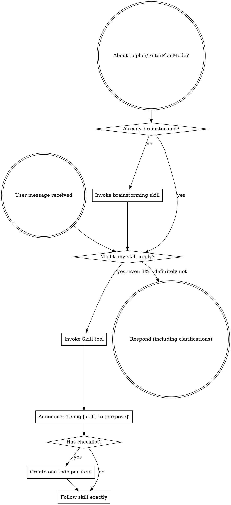

<SUBAGENT-STOP>
If you were dispatched as a subagent to execute a specific task, skip this skill.
</SUBAGENT-STOP>

<EXTREMELY-IMPORTANT>
If you think there is even a 1% chance a skill might apply to what you are doing, you ABSOLUTELY MUST invoke the skill.

IF A SKILL APPLIES TO YOUR TASK, YOU DO NOT HAVE A CHOICE. YOU MUST USE IT.

This is not negotiable. This is not optional. You cannot rationalize your way out of this.
</EXTREMELY-IMPORTANT>

> **Engineering-core** is the portable software-engineering discipline pack for the Hermes toolkit. It is adapted from the MIT-licensed [obra/superpowers](https://github.com/obra/superpowers) (see `ATTRIBUTION-superpowers-LICENSE.txt`). It is loaded **only** into software/product (CODE) contexts, never into GTM/business contexts.

## Instruction Priority

Engineering-core skills override default model behavior, but **user instructions always take precedence**:

1. **User's explicit instructions** (AGENTS.md, SOUL.md, CLAUDE.md, GEMINI.md, direct requests) — highest priority
2. **Engineering-core skills** — override default behavior where they conflict
3. **Default system prompt** — lowest priority

If a grounding file says "don't use TDD" and a skill says "always use TDD," follow the user. The user is in control. (Note: in this toolkit, AGENTS.md/LOCKED-DECISIONS.md are themselves the ground truth — never override a locked decision.)

## How to Access Skills

**In Hermes** (the toolkit's primary runtime): skills are invoked by name. A worker is given skills via the `--skill <name>` flag or by naming them in the `delegate_task` context. This bootstrap is auto-loaded every message via the profile's `SOUL.md`. Reference other skills by their bare `name`. See `references/hermes-tools.md` for the `delegate_task`/`--skill` ↔ Skill-tool mapping.

**In Claude Code:** use the `Skill` tool; this bootstrap is injected at session start via a `SessionStart` hook. Never use the Read tool on skill files.

**On a local model** (served via vLLM/LiteLLM): the harness has no native skill tool — the controller pastes the skill body into the worker's context. See `references/local-tools.md` for how subagent dispatch, todos, and skill loading map onto a plain OpenAI-compatible endpoint.

**Other harnesses** (Codex, Gemini CLI, Copilot CLI): see `references/{codex,gemini,copilot}-tools.md` for tool-name equivalents.

# Using Skills

## The Rule

**Invoke relevant or requested skills BEFORE any response or action.** Even a 1% chance a skill might apply means you should invoke the skill to check. If an invoked skill turns out wrong for the situation, you don't need to use it.



## The Engineering Pipeline

For any build or change, skills chain in this fixed order. Each arrow is a gate — do not skip forward.

```
brainstorming  →  using-git-worktrees  →  writing-plans
  →  subagent-driven-development (or executing-plans)  →  test-driven-development
  →  requesting-code-review (reviewer MUST differ from author)
  →  smoke-gate (boot + login proven)  →  finishing-a-development-branch
```

**Non-negotiable gates (this toolkit's hard-won additions):**

- **REQUIRED SUB-SKILL:** Use engineering-core:ground-truth-anchor at session start and after every context compaction — re-assert the project root + LOCKED-DECISIONS before any file-creating action. (Prevents wrong-repo scaffolding and decision drift.)
- **REQUIRED SUB-SKILL:** Use engineering-core:verification-before-completion before ANY "done" claim — claims need cited run-evidence (exit codes / test output / screenshot / health check), never assertions.
- **REQUIRED SUB-SKILL:** Use engineering-core:smoke-gate before completing any full-stack change — the stack must boot and a real login must round-trip.
- **REQUIRED SUB-SKILL:** Use engineering-core:frontend-visual-verification before completing any UI change — navigate, screenshot, read console + network; never edit the frontend blind.
- **REQUIRED SUB-SKILL:** Use engineering-core:model-routing to pick the right model tier per role, and engineering-core:stack-decision for any tech-stack/Go-migration choice.

## Red Flags

These thoughts mean STOP — you're rationalizing:

| Thought | Reality |
|---------|---------|
| "This is just a simple question" | Questions are tasks. Check for skills. |
| "I need more context first" | Skill check comes BEFORE clarifying questions. |
| "Let me explore the codebase first" | Skills tell you HOW to explore. Check first. |
| "I can check git/files quickly" | Files lack conversation context. Check for skills. |
| "Let me gather information first" | Skills tell you HOW to gather information. |
| "This doesn't need a formal skill" | If a skill exists, use it. |
| "I remember this skill" | Skills evolve. Read current version. |
| "It built, so it works" | Booting + login + render are unproven until observed. Run the gates. |
| "I changed the file, that's progress" | Editing ≠ verifying. No done without evidence. |
| "The frontend edit looks right" | You haven't seen it render. Visual-verify or it isn't done. |
| "I'll just do this one thing first" | Check BEFORE doing anything. |
| "I know what that means" | Knowing the concept ≠ using the skill. Invoke it. |

## Skill Priority

When multiple skills could apply:

1. **Process skills first** (brainstorming, systematic-debugging) — they determine HOW to approach the task.
2. **Implementation skills second** — they guide execution.

"Let's build X" → brainstorming first. "Fix this bug" → systematic-debugging first.

## Skill Types

**Rigid** (TDD, debugging, the gates above): Follow exactly. Don't adapt away discipline.

**Flexible** (patterns): Adapt principles to context.

The skill itself tells you which.

## User Instructions

Instructions say WHAT, not HOW. "Add X" or "Fix Y" doesn't mean skip the pipeline or the gates.
