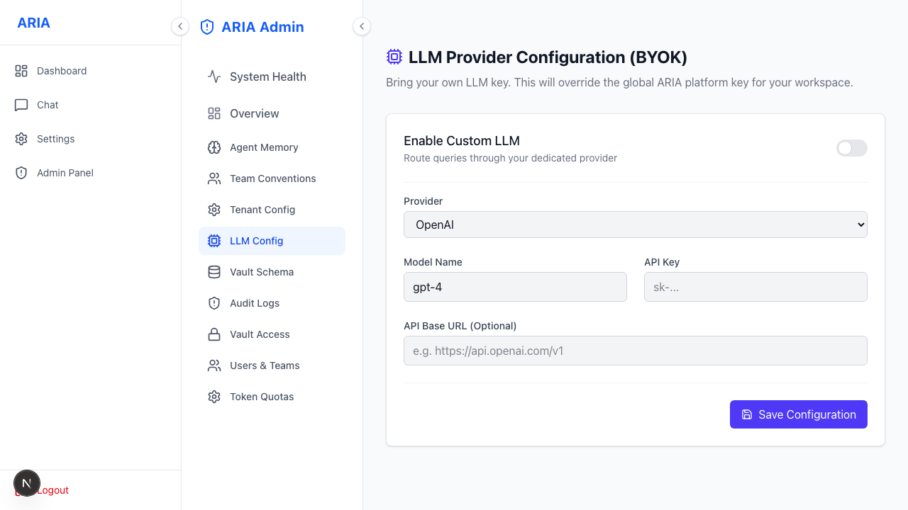

# Admin · LLM Configuration (BYOK)

Use **your own** LLM provider key — see the concept in [Bring Your Own Key](./byok.md).

**What you can do here**
- Choose provider (OpenAI / Azure OpenAI / Anthropic / Gemini), endpoint, model.
- Paste your API key — it is **write-only** (encrypted at rest, never shown back).
- Leave empty to use the platform default.
