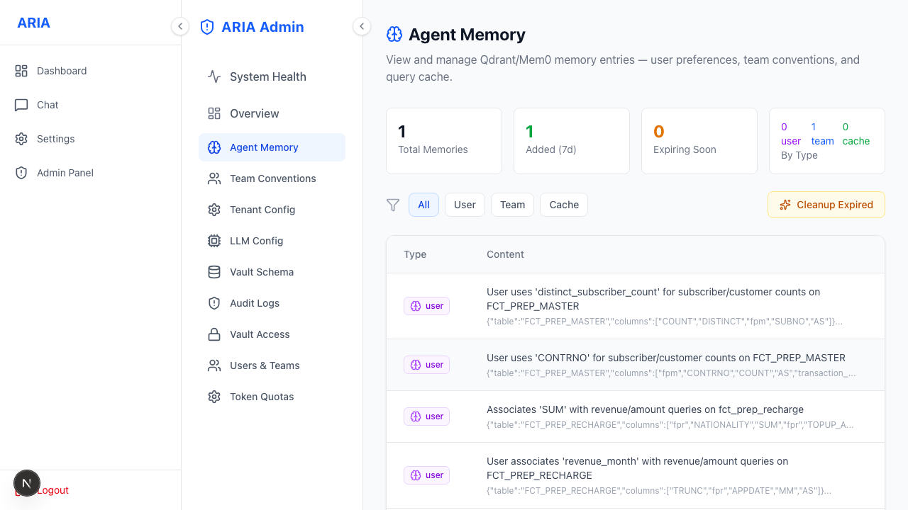
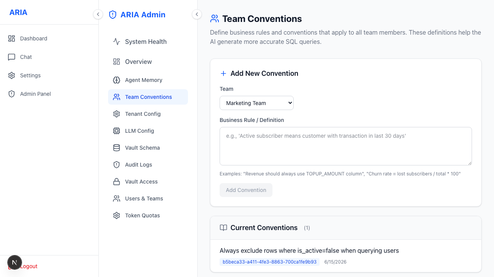

# Admin · Memory

Inspect and manage ARIA's long-term memory (Mem0 + Qdrant).

User / team / query-cache entries, with TTL control. Team-level conventions live here too:

See the concept: [Team Memory](./team-memory.md).
