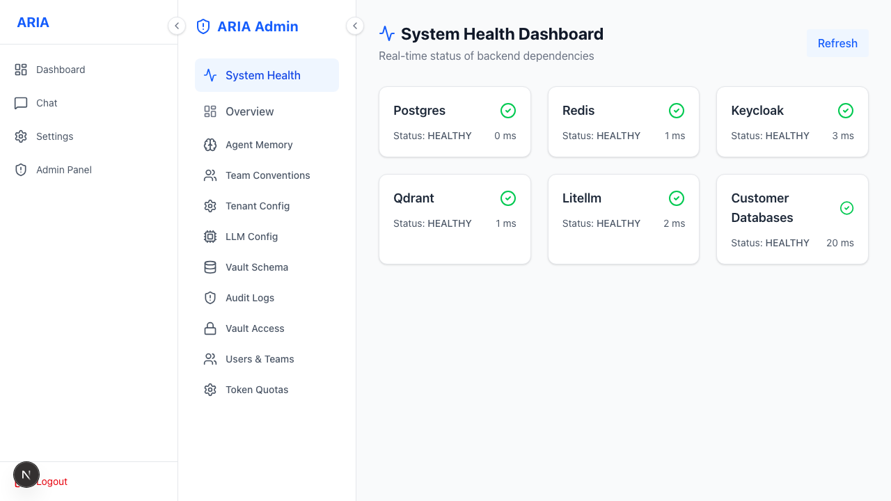
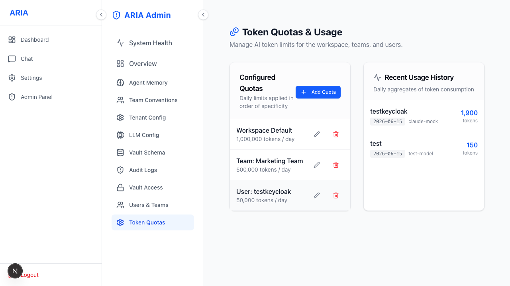
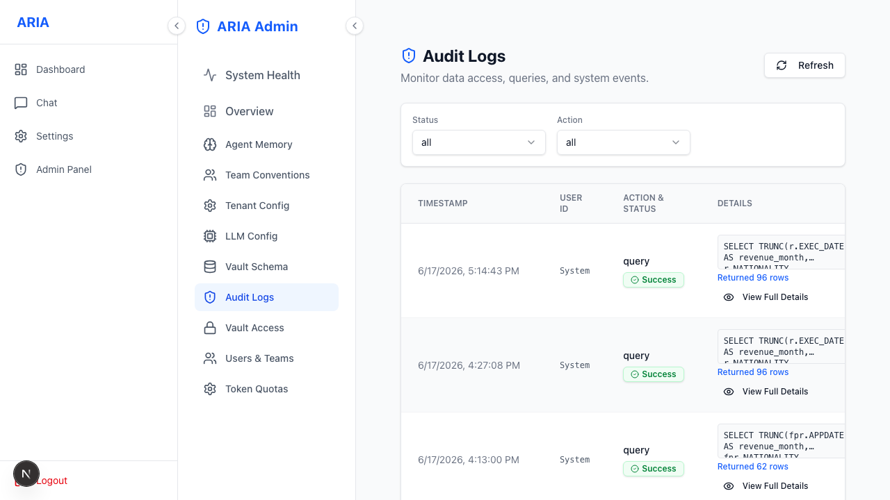
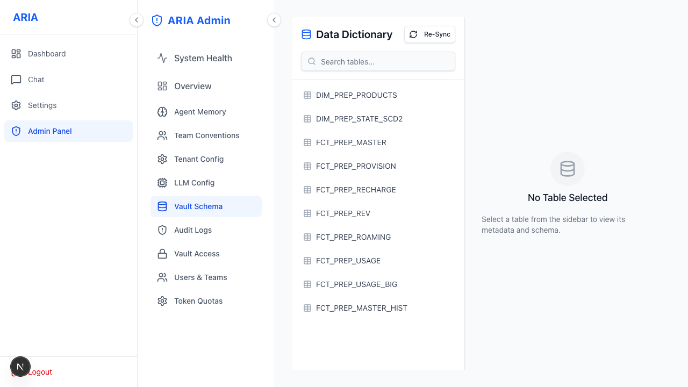

# Admin · Monitoring & Audit

Operational visibility.

**Health** — live status of Postgres, Redis, Keycloak, Qdrant, LiteLLM and customer DBs.

**Tokens** — API token management and quota usage.

**Audit log** — searchable record of data-access events (queries, exports, vault reads) for compliance.

**Schema** — the cached schema snapshot and discovery TTL.

