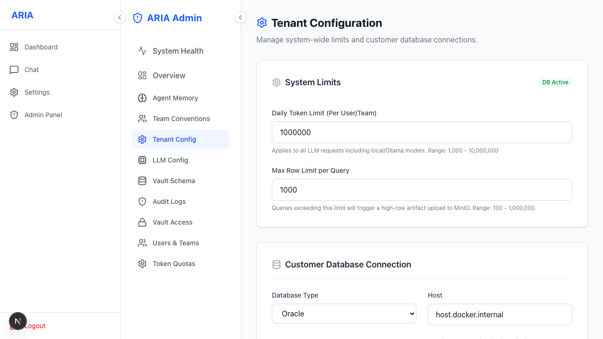

# Admin · Tenant Configuration

Global guardrails for the customer workspace.

**What you can set**
- **Row limit** per query (default 10K; overflow becomes a background report).
- **Token quota** (daily limits per user / team).
- Rate limits and other workspace-wide policies.
