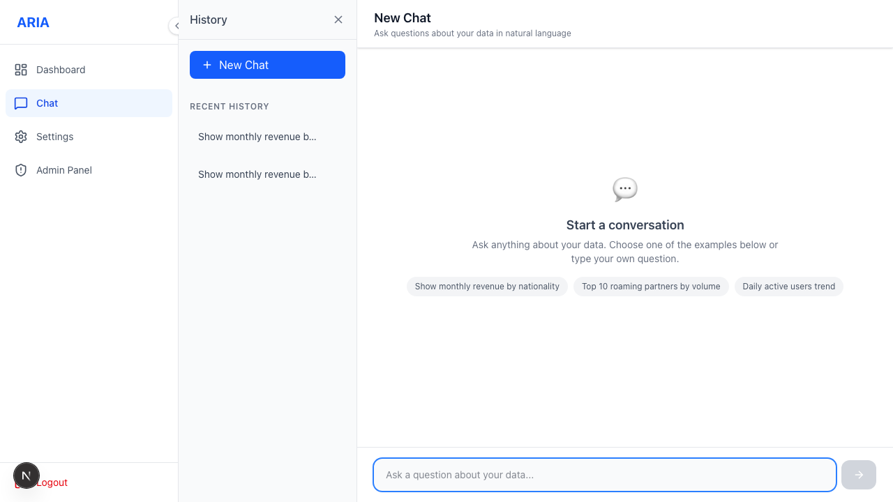

# How a Chat Answer Works

The **Chat** screen is where you ask questions in plain language. ARIA shows each step live
(no blank screen): understand intent → match the right table → generate safe SQL (guarded +
dry-run) → run on your warehouse → render a chart → add a business insight.

**What you can do here**
- Type any question (e.g. *"total revenue by month"*) and watch the streaming steps.
- See the answer as a **chart** plus a short **insight**; switch chart palette where enabled.
- If your role allows it, expand the generated **SQL** and the raw rows to verify the result.
