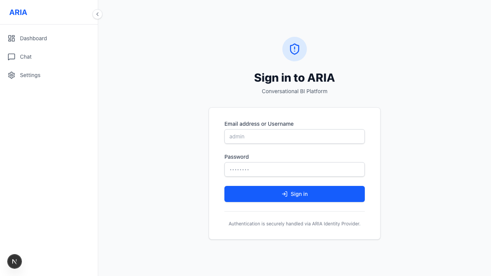

# Welcome to the ARIA Academy

ARIA lets your team **ask questions of your data in plain language** and get an answer, a chart,
and a short business insight — no SQL, no waiting on the data team.

This guide walks you **through the screens**: what each one does and how to use it.

- **Getting Started** — why ARIA, and how a chat answer is built.
- **Security & Governance** — BYOK and how your data stays yours.
- **Analytics & Artifacts** — chart types and exports.

## Signing in

You reach ARIA at your team's URL and sign in with your organization account:

_This screenshot is produced automatically by the `aria-docs` pipeline (`e2e/docs-screenshots.spec.ts`)._
