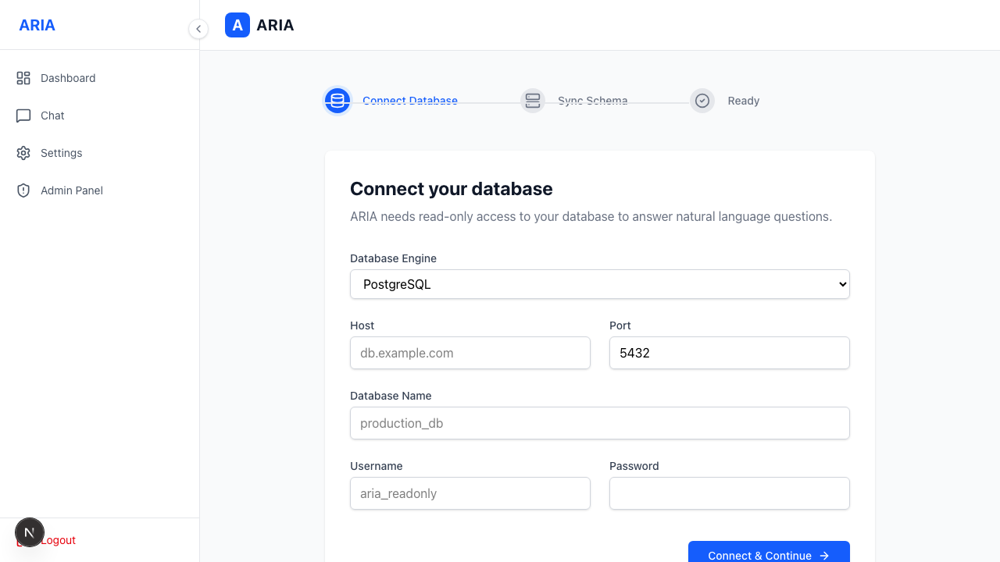
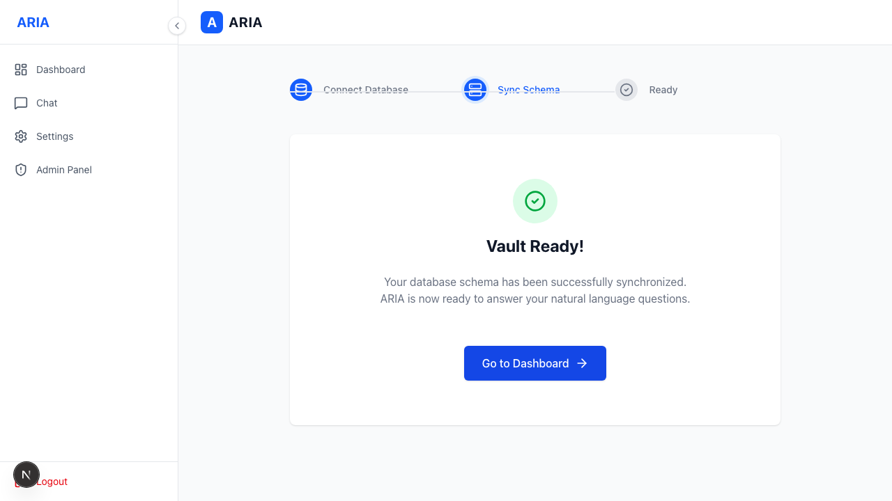

# Connecting Your Data

First-run setup connects ARIA to **your** data warehouse and builds the semantic layer.

## 1. Database connection

Enter your warehouse type, host, port, database and credentials. The password is **encrypted at rest**.

## 2. Schema sync

ARIA discovers your schema, generates the **semantic vault** (so it understands your tables in
business terms), and ingests it for retrieval. Re-running a sync keeps your edits to keywords and
descriptions.
