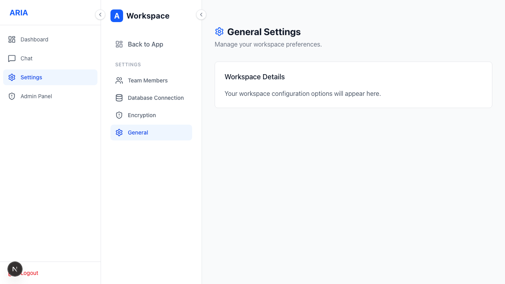
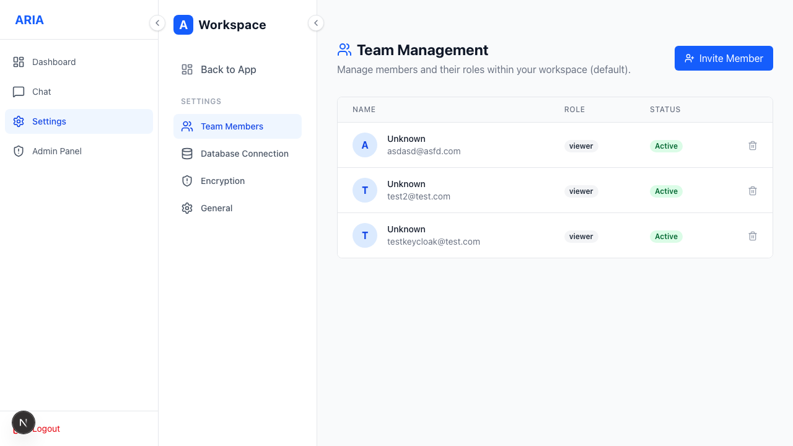
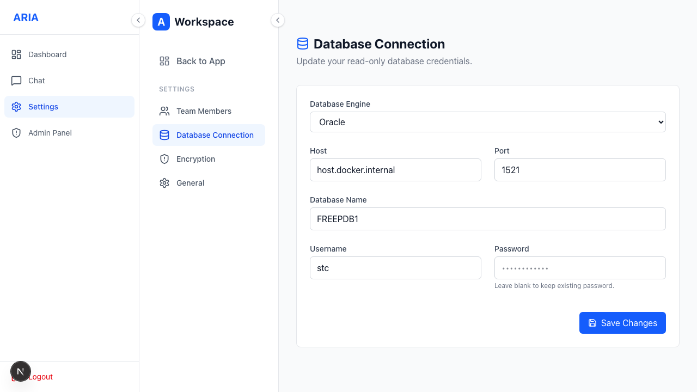
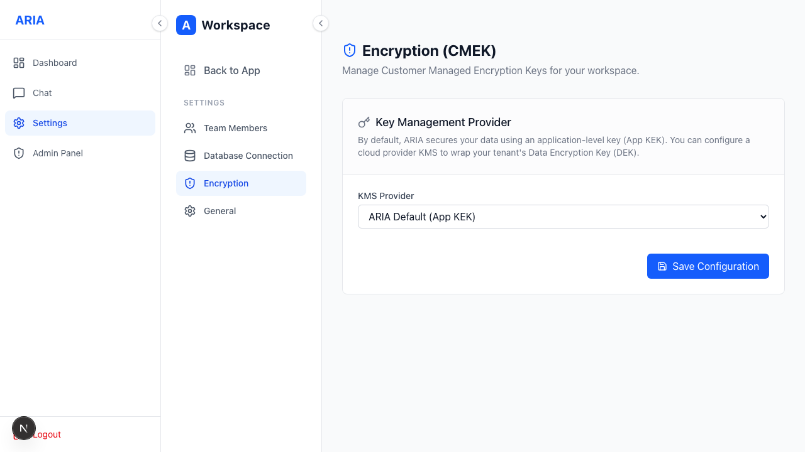

# Settings

Manage your workspace, team, data connections and encryption.

**Sections**
- **Team** — manage members and roles.
  
- **Database** — view/edit connected database configs.
  
- **Encryption** — choose the encryption key provider (app-managed or your own KMS — see
  [CMEK](./cmek.md)).
  
